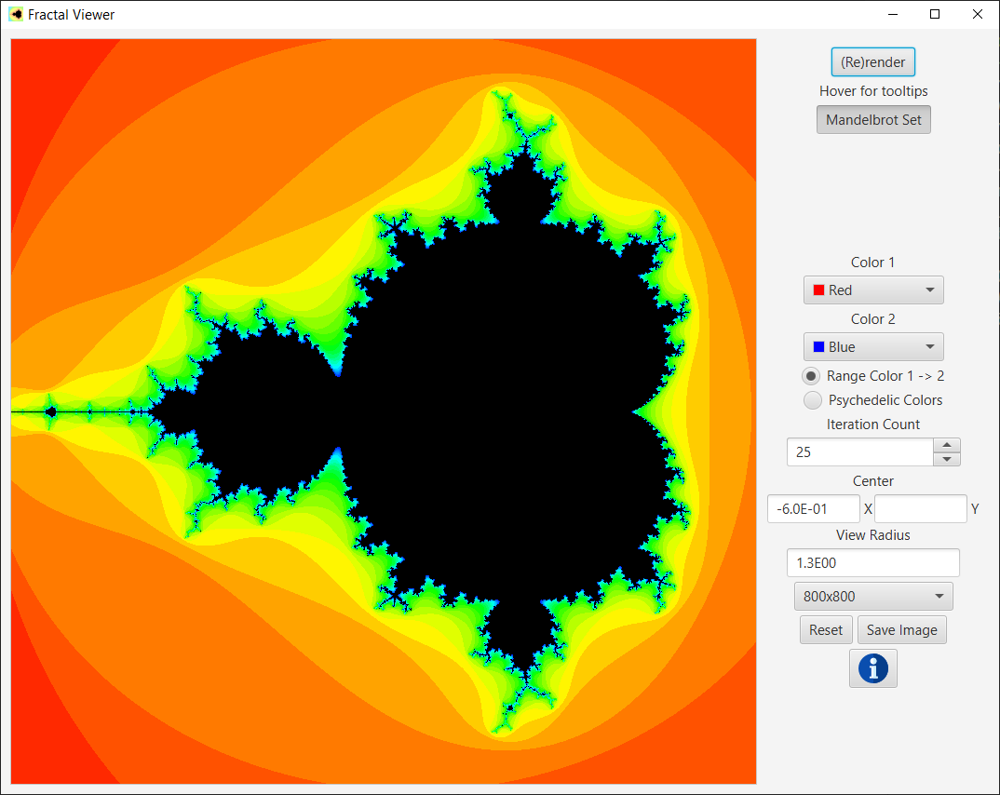
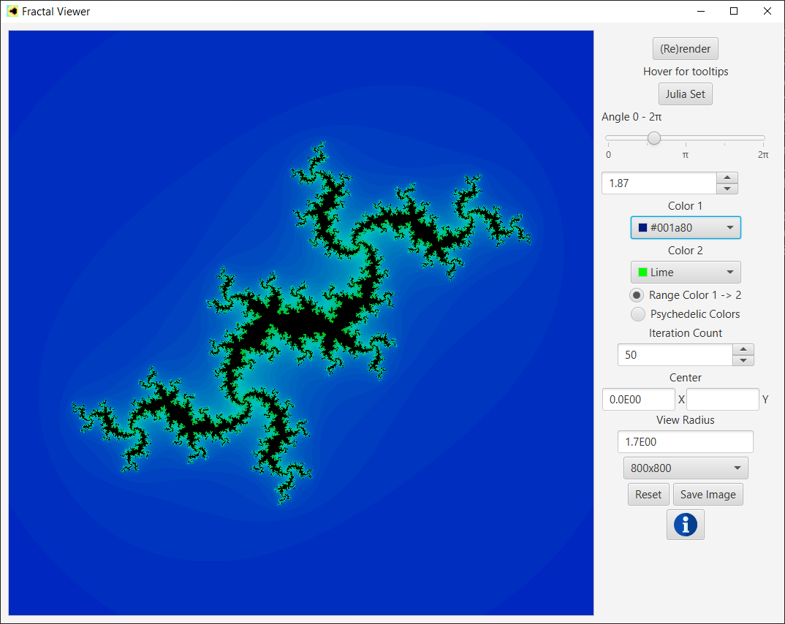
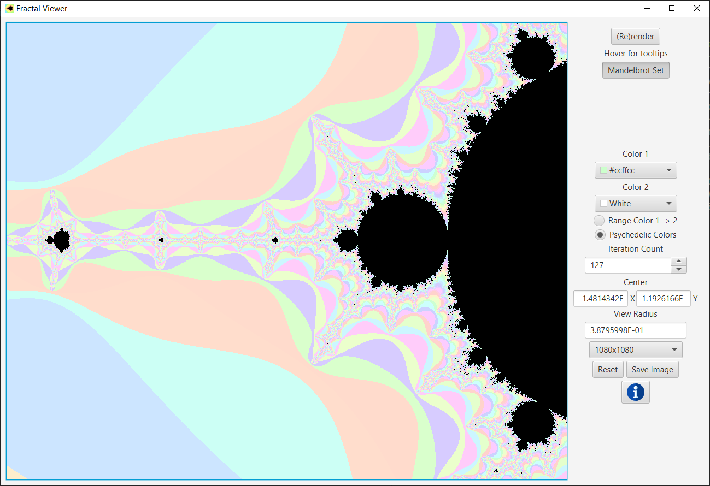

# Mandelbrot & Julia Fractal Viewer #
## CS2 JAVAFX project ##

A fractal exploration program written in Java.

## Running:
Ant project managed with NetBeans IDE (but actually coded in VScode).

Actually running the compiled .jar is a bit of a pain. JavaFX isn't included in the Java JDK anymore, and is kinda outdated anyway.
If you have JavaFX installed, something like this might work. I don't know why everything can't be packaged in the jar. Something about modular applications.
> `java --enable-preview --module-path $PATH_TO_FX --add-modules javafx.controls -jar MandelbrotSet.jar`

Written with AdoptOpenJDK 15 and Gloun Open JavaFX 15 (from [Scoop](https://github.com/lukesampson/scoop)) on Windows 10. Other platforms untested

### Screenshots ###

### TODO ###
- [x] Change rendered area
- [x] Change resolution
- [x] Set center point w/ RMB
- [x] Info popup with keys